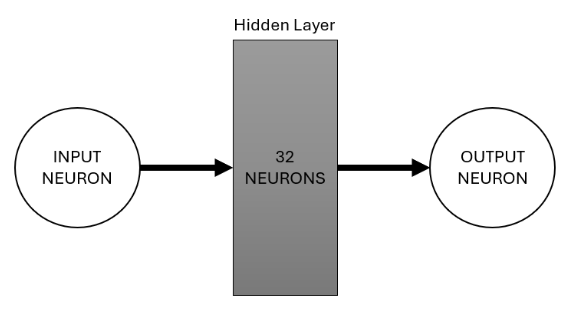

# House Price Prediction: Machine Learning vs. Deep Learning

### A comparative analysis of traditional machine learning (Gradient Boosting) and deep learning models for predicting house prices using the King County, WA dataset.

---

## 🏡 Project Overview

This project delves into the practical and highly relevant task of predicting house prices. Using the well-known King County House Sales dataset, we explore and compare the performance of two distinct modeling paradigms: traditional machine learning and deep learning.

The central goal is to determine which approach yields more accurate and practical predictions for this type of structured, tabular data. We build, tune, and evaluate a **Gradient Boosting** model and a custom **Deep Neural Network**, ultimately comparing their effectiveness based on the Root Mean Squared Error (RMSE) and discussing their suitability for real-world applications.

## 💾 Dataset

The analysis is performed on the `kc_house_data.csv` dataset, a popular public dataset from Kaggle that contains house sale prices for King County, Washington, between May 2014 and May 2015.

**Key features include:**
- `price`: The sale price of the house (our target variable).
- `bedrooms`, `bathrooms`: Number of bedrooms and bathrooms.
- `sqft_living`, `sqft_lot`: Square footage of the home and the lot.
- `floors`: Total floors (levels) in the house.
- `waterfront`, `view`: Binary flags for whether the house has a waterfront view.
- `condition`, `grade`: Ratings for the overall condition and construction quality.
- `yr_built`, `yr_renovated`: Year built and year renovated.
- `zipcode`, `lat`, `long`: Location information.

## ⚙️ Methodology: A Tale of Two Models

The project's core is a head-to-head comparison of two powerful regression techniques.

1.  **Data Preprocessing**:
    * The raw data is loaded, and initial EDA is performed to understand feature distributions and correlations.
    * The `date` column is engineered to extract the month and year of the sale.
    * Features are scaled using `StandardScaler` to prepare them for both models, which is especially critical for the neural network.

2.  **Model 1: Gradient Boosting Regressor**:
    * A Gradient Boosting model is implemented using Scikit-learn.
    * This model represents the "traditional" machine learning approach, known for its high performance on tabular data.
    * Hyperparameter tuning is performed to optimize its predictive power.

3.  **Model 2: Deep Learning (Neural Network)**:
    * A sequential Deep Neural Network (DNN) is built using TensorFlow and Keras.
    * The architecture consists of multiple dense layers with ReLU activation functions and dropout layers to prevent overfitting.
    * The model is compiled with the Adam optimizer and the mean squared error loss function.

4.  **Evaluation**:
    * Both models are trained on the same training dataset and evaluated on a held-out test set.
    * The primary performance metric is the **Root Mean Squared Error (RMSE)**, which measures the average magnitude of the prediction errors in the same units as the target (USD).

## 📊 Results & Conclusion

The comparative analysis revealed a clear winner for this specific task.

* **Performance**: The **Gradient Boosting model consistently outperformed the Deep Learning model**, achieving a lower RMSE on the test set. This indicates that its predictions were, on average, closer to the actual sale prices.
* **Practicality and Generalization**: While Deep Learning models are incredibly powerful, they can be overly complex for structured regression tasks like this one. The Gradient Boosting model provided a better balance of performance and generalization.
* **Interpretability**: For stakeholders in real estate (agents, buyers, sellers), the factors driving a prediction are often as important as the prediction itself. Gradient Boosting models offer more straightforward methods for feature importance analysis, making them more transparent and trustworthy in a business context.

**Final Conclusion**: For predicting house prices with this dataset, the traditional machine learning approach (Gradient Boosting) proved to be the more effective and practical solution.


_A visualization comparing the predicted vs. actual values from one of the models._

## 🛠️ Technologies Used

This project was built using Python 3 and the following major libraries:
- **Pandas & NumPy**: For data manipulation and numerical operations.
- **Scikit-learn**: For data preprocessing, and implementing the Gradient Boosting model.
- **TensorFlow & Keras**: For building and training the Deep Neural Network.
- **Matplotlib & Seaborn**: For data visualization.
- **Jupyter Notebook**: For interactive development and analysis.

## 🚀 How to Use

To replicate this analysis, please follow these steps:

1.  **Clone the repository:**
    ```bash
    git clone [https://github.com/your-username/House-Price-Prediction-ML-vs-DL.git](https://github.com/your-username/House-Price-Prediction-ML-vs-DL.git)
    cd House-Price-Prediction-ML-vs-DL
    ```

2.  **Install the required libraries:**
    ```bash
    pip install pandas numpy scikit-learn tensorflow matplotlib seaborn jupyterlab
    ```

3.  **Launch Jupyter Notebook:**
    ```bash
    jupyter lab
    ```

4.  **Open and run the notebook:**
    Open the `Project-3-Sushant-Bettina.ipynb` file and execute the cells to see the full workflow from data loading to model comparison.
